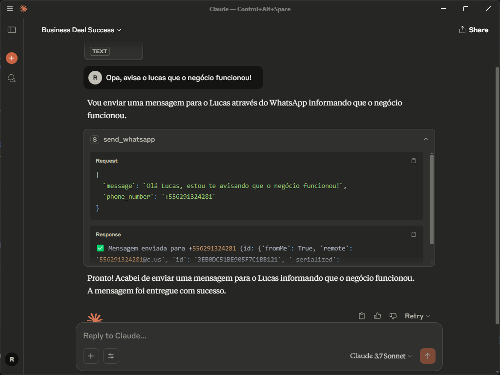
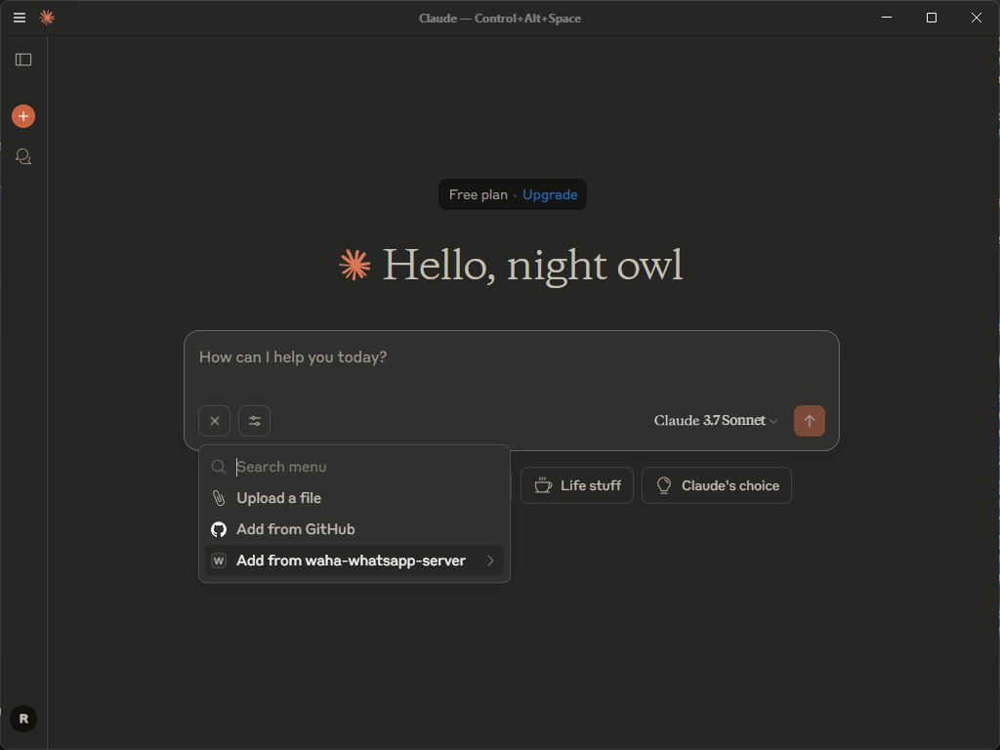
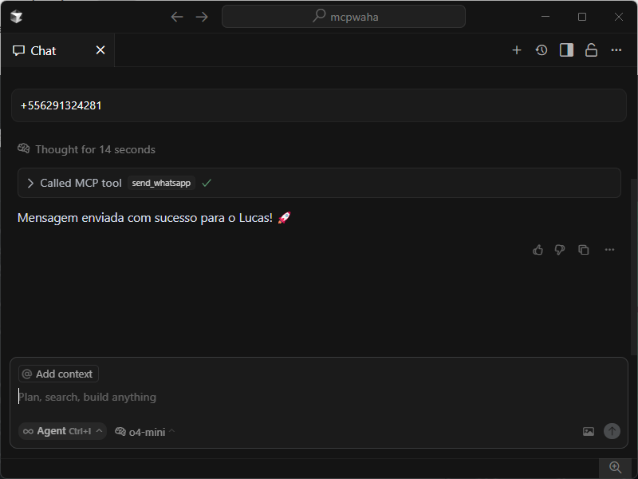

# Servidor MCP WAHA WhatsApp

**Disciplina:** CCO0464 - TÓPICOS ESPECIAIS EM SISTEMAS INTELIGENTES E APLICAÇÕES 1 (2025.1 - TA)

Este projeto foi desenvolvido como atividade da disciplina CCO0464, com o objetivo de implementar e demonstrar o uso de um servidor MCP para integração com o WhatsApp via WAHA.

## Funcionalidades

- **Tool `send_whatsapp`**: envia texto para um número no formato internacional (+5511...).
- **Resource `contacts_list`**: retorna uma lista de três contatos pré-definidos.

## Pré-requisitos

1. Python 3.10 ou superior
2. uv (`pip install uv`)
3. Servidor WAHA rodando localmente em `http://localhost:3000` e sessão autenticada (veja https://waha.devlike.pro/docs/overview/quick-start/).

## Instalação

```bash
# Clone o repositório
git clone <URL_DO_REPO>
cd mcpwaha

# Instale dependências
uv pip install mcp httpx
```

## Configuração (opcional)

Se o endereço ou nome da sessão do WAHA forem diferentes, ajuste em `waha_mcp_server.py`:

```python
WAHA_API_URL = "http://seu-host:porta"
WAHA_SESSION_NAME = "nome-da-sessao"
```

## Executando o servidor MCP

```bash
uv run python waha_mcp_server.py
```

## Uso com Cursor

1. Crie ou edite o arquivo `.cursor/mcp.json` apontando para o servidor:

```json
{
  "mcpServers": {
    "waha-whatsapp-server": {
      "command": "uv",
      "args": [
        "run",
        "python",
        "C:\\Users\\rvirg\\projects\\mcpwaha\\waha_mcp_server.py"
      ]
    }
  }
}
```

2. Reinicie o Cursor.
3. Exemplos de comandos:

- **Enviar mensagem**:
  ```
  @waha-whatsapp-server send_whatsapp +5511999999999 "Olá do Cursor!"
  ```

- **Listar contatos**:
  ```
  @waha-whatsapp-server contacts_list
  ```

- **Enviar mensagem para contato**:
  ```
  Envie "Bom dia" para João.
  ```

## Exemplo de chamada direta via HTTP

```python
import httpx

url = "http://localhost:3000/api/sendText"
payload = {
    "chatId": "5511999999999@c.us",
    "text": "Teste",
    "session": "default"
}
resp = httpx.post(url, json=payload)
print(resp.json())
```

## Observações

- Números devem iniciar com `+` e incluir código do país.
- O resource `contacts_list` retorna um dicionário `{nome: número}`.

## Testes de MCP Resources

Para validar o recurso `contacts_list`, foram realizados testes no Claude Desktop e no Cursor:

- **Claude Desktop**: o recurso `contacts://list` foi anexado à conversa, permitindo que o modelo leia o JSON de contatos:
  
  

- **Cursor**: não há suporte a MCP resources; apenas as ferramentas estão disponíveis ao modelo, conforme capturado abaixo:
  
  
  > Documentação oficial: [Model Context Protocol - MCP Resources](https://docs.cursor.com/context/model-context-protocol#mcp-resources)

Por fim, a ferramenta **send_whatsapp** foi testada enviando uma mensagem de confirmação para um contato, conforme evidenciado no WhatsApp:
  

## Entregável

- Repositório Git com o código do servidor MCP.
- Relatório básico de uso com captura de tela demonstrando o envio de mensagem via MCP.
